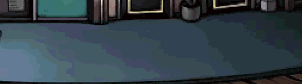

# Image Color Banding using NVIDIA NPP with CUDA

## Overview

This project demonstrates the use of NVIDIA Performance Primitives (NPP) library with CUDA to perform image colorspace downsampling.
The goal is to utilize GPU acceleration to produce images that have strong color banding in gradients of an image.

For example, the goal is to make gradients like this image from Touch Detectiv (DS, 2006).





Notice how the image is a gradient from light to dark blue, but the gradient isn't smooth.
The gradient is limited to a dozen or so shades of blue so there is a distinct line where the shades change.
Further, the changes are not straight or curved lines but are wiggly with possibly some underlying structure or commonalities between the lines.

Personally, I like this astetic and want to have a semi-structured way to produce this kind of effect.

To do that I'll use NPP to apply some random set of effects to a smooth gradient, recording which effects are applied.
Then the image will have its colorspace reduced, again in a somewhat random and recorded way.
Finally, I'll use edge detection to determine how "wiggly" and noticable, the color banding is.
These steps will be applied multiple times to the same initial gradient, other gradients, and gradients with a texture overlay.
I'll then keep only those images that meet some edge detection threashold and manually inspect them to see which combination of effects I like the most.

Hopefully I'll be able to use these results to create this kind of effect manually in drawing programs like gimp or photoshop in the future.
Or possibly even create a plugin for those programs.

The project is a part of the CUDA at Scale for the Enterprise course.

## Code Organization

```bin/```
This folder holds all binary/executable code.

```data/```
This folder holds all example data.

```data/textures```
Textures applied to the gradient before downsampling.
The images are all pulled from [transparent textures](https://www.transparenttextures.com/).

```data/pof```
These images are saved while the program is running, as proof of it running across a large set of data.
The name of each picture is the seed used to create it and the step.
Images without steps are the final images and the text file is the set of steps run.

```data/results```
Final images for any image that matches the "wiggly" threshold.

```lib/```
Any libraries that are not installed via the Operating System-specific package manager should be placed here, so that it is easier for inclusion/linking.

```src/```
The source code.

```include/```
Additional header files to include.

```include/util.h```
Utility functions for dealing with npp types.

```README.md```
You are here.

```INSTALL```
human-readable set of instructions for installing.

```Makefile```
Build the project.

## Supported OSes

Linux

## Supported CPU Architecture

x86_64

## CUDA APIs involved

## Dependencies needed to build/run
NPP

## Prerequisites

Download and install the [CUDA Toolkit 11.4](https://developer.nvidia.com/cuda-downloads) for your corresponding platform.
Make sure the dependencies mentioned in [Dependencies]() section above are installed.

## Build and Run

### Linux
```
$ make
```

Options:
*  **TARGET_ARCH=<arch>** - cross-compile targeting a specific architecture. Allowed architectures are x86_64, ppc64le, armv7l.
    By default, TARGET_ARCH is set to HOST_ARCH. On a x86_64 machine, not setting TARGET_ARCH is the equivalent of setting TARGET_ARCH=x86_64.<br/>
`$ make TARGET_ARCH=x86_64` <br/> `$ make TARGET_ARCH=ppc64le` <br/> `$ make TARGET_ARCH=armv7l` <br/>
    See [here](http://docs.nvidia.com/cuda/cuda-samples/index.html#cross-samples) for more details.
*   **dbg=1** - build with debug symbols
    ```
    $ make dbg=1
    ```
*   **SMS="A B ..."** - override the SM architectures for which the sample will be built, where `"A B ..."` is a space-delimited list of SM architectures. For example, to generate SASS for SM 50 and SM 60, use `SMS="50 60"`.
    ```
    $ make SMS="50 60"
    ```

*  **HOST_COMPILER=<host_compiler>** - override the default g++ host compiler. See the [Linux Installation Guide](http://docs.nvidia.com/cuda/cuda-installation-guide-linux/index.html#system-requirements) for a list of supported host compilers.
```
    $ make HOST_COMPILER=g++
```


## Running the Program
After building the project, you can run the program using the following command:

```bash
make run
```
- Cleaning Up
To clean up the compiled binaries and other generated files, run:


```bash
make clean
```

This will remove all files in the `bin/` directory and any images generated in `data/`.
